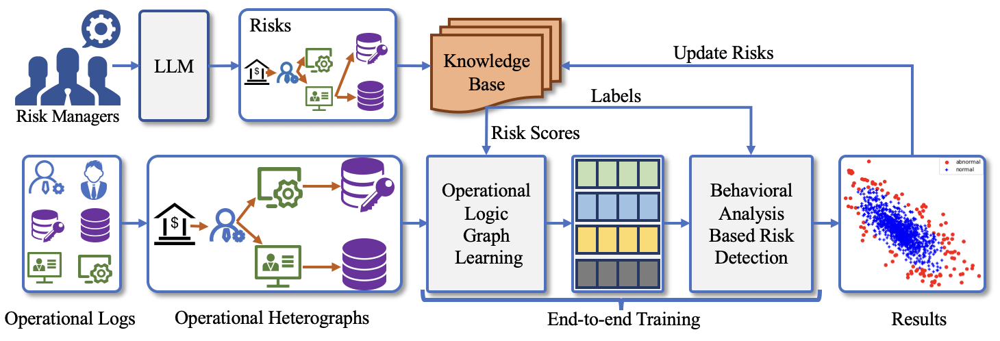
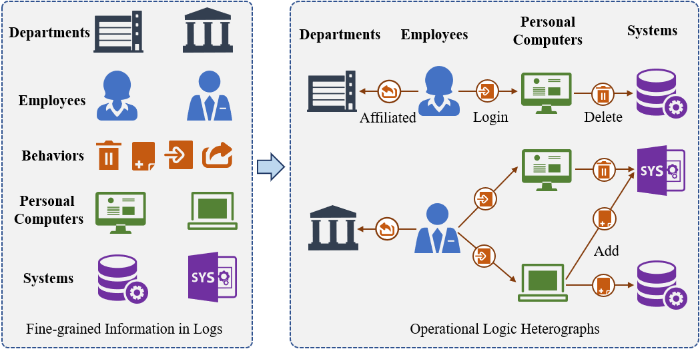

# Behavioral Logic Heterograph Learning Enhanced with Expert Experience to Identify Operational Risks
## Abstract
Operational risks are a prevalent issue across various industries, potentially causing substantial losses each year. The identification and prevention of operational risks have been drawing significant attention. 
However, operational risks have three characteristics that make identification challenging: (a) involvement of multiple interrelated heterogeneous entities, (b) insufficient risk labels due to their low frequency, and (c) dynamically changing risk patterns.
For addressing such three issues, we here propose a novel risk identification framework combining graph pretraining with fine-tuning. 
In the graph pretraining stage, behavioral logic is depicted by heterographs, which are then mapped into low-dimensional vectors by a heterograph learning algorithm enhanced with expert experience.
By injecting expert experience, subtle changes in operational risk features can be captured.
During the fine-tuning phase, we devise a risk identification model built upon psychological behavioral analysis. This model exhibits superior generalization performance, particularly in scenarios with limited risk labels and shifting risk patterns.
Experiments conducted on a series of operational risk datasets have demonstrated that our framework exhibits outstanding performance.
## Framework
In this framework, we first use a large language model (LLM) to transform expert experience into a series of abnormal operational graphs and inject them into the knowledge base. Using such data, we train a risk scoring model, which guides the learning of operational logic heterogeneous graphs that are encoded into low-dimensional vectors. Next, we estimate the distribution of these vectors to identify operational risks. Finally, risk experts further review the model results and update the knowledge base.

The heterogeneous graphs, consisting of different types of nodes and edges, are a powerful data structure usually used for abstracting and depicting complex systems in which objects of different types interact with each other in various ways.
In this study, we apply heterographs to model the streaming operational logic.

Then we introduce a novel behavioral logic heterograph learning enhanced with expert experience. we initially develop a risk scoring model, informed by expert experience, capable of allocating scores within the interval $(0,1)$ corresponding to varying risk levels. Subsequently, during the graph contrastive learning phase, we employ these expert-derived scores to fine-tune the spatial distribution of graph features within a low-dimensional space. This strategy ensures that all normal samples are oriented towards a concentrated and evenly distribution in the space, while directing risk-bearing samples towards distinctly separate regions.

